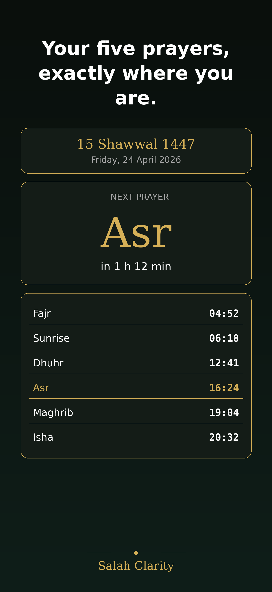
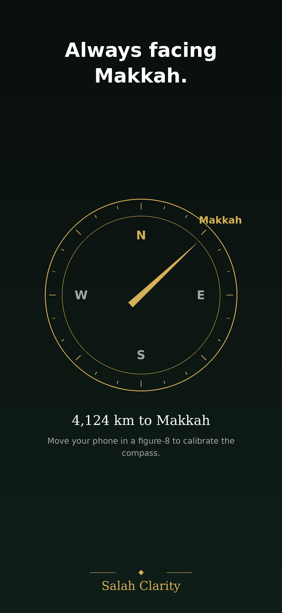
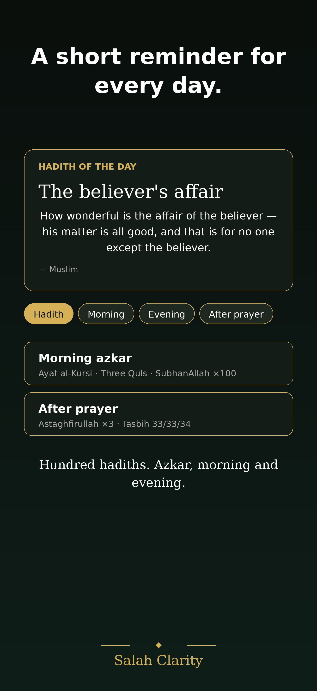

# Salah Clarity

> A calm, private iOS companion for the five daily prayers.
> No accounts. No servers. No ads. Your location stays on your device.


<p align="center">
  
  
  
</p>

---

## What it does

- **Prayer times** — Fajr, Dhuhr, Asr, Maghrib, Isha, plus Sunrise for reference. Computed locally using a standalone implementation of the University of Islamic Sciences (Karachi) algorithm documented by [PrayTimes.org](http://praytimes.org).
- **Qibla compass** — points to Makkah from wherever you are, with distance to the Kaaba.
- **Qaza tracker** — keep count of prayers you owe and pay back, with a gentle daily streak.
- **Reminders** — one hadith a day from a curated pool of 100 (Bukhari, Muslim, Tirmidhi, Abu Dawud, Ibn Majah, An-Nasa'i, Ahmad), plus morning / evening azkar and post-prayer dhikr.
- **Tahajjud reminder (optional)** — shows and notifies at the start of the last third of the night, computed from Isha and the next day's Fajr.
- **Adhan sound** — the real azan for fard prayer notifications; falls back silently to the default iOS chime if the audio file isn't bundled.
- **Three languages** — English, Русский, Кыргызча. Language switches take effect instantly, no app restart.

## Design principles

1. **Private by construction.** Location is requested once and used on-device to calculate times. No servers, no tracking, no analytics sold to anyone.
2. **Offline-first.** Every feature works without an internet connection. All content (hadiths, azkar, prayer-time algorithm) ships with the app.
3. **Calm.** Dark-first mosque-inspired theme: deep green + warm gold. Minimum UI noise. No red badges, no streak shaming.
4. **One focused app.** No subscription, no upsell. Just the times, the direction, and a short reminder each day.

## Tech stack

| Layer | Choice |
| --- | --- |
| UI | SwiftUI (NavigationStack, `@Observable`, `.animation(_:value:)`) |
| Persistence | SwiftData (`@Model` for `QazaRecord`, `QazaCompletion`, `UserSettings`) |
| Location | CoreLocation |
| Notifications | `UserNotifications` + `UNCalendarNotificationTrigger` |
| Runtime i18n | Custom `LocalizationManager` — a `Bundle` subclass swap that lets `NSLocalizedString` re-read from another `.lproj` without relaunch |
| Project format | Xcode 16 `PBXFileSystemSynchronizedRootGroup` — files added on disk are picked up automatically |

No SwiftPM dependencies in production. Firebase and StoreKit hooks are scaffolded (see `Services/AnalyticsService.swift`, `Services/CrashReportingService.swift`, `Services/TipJarService.swift`) but disabled by default — enabling them is a one-line TODO.

## Project structure

```
SalahClarity/
├── App/                         SwiftUI entry point + TabView root
├── Assets.xcassets/             Colors, AppIcon
├── Design/                      Theme (colors, fonts) + Hijri date formatter
├── Features/
│   ├── PrayerTimes/             Prayer-time calculator, view model, view
│   ├── Qaza/                    Missed-prayer tracker
│   ├── Qibla/                   Compass
│   ├── Reminders/               Hadiths + azkar list + daily hadith
│   └── Settings/                Calculation method, language, notifications
├── Models/                      SwiftData models + enums (Prayer, CalculationMethod, AsrMethod)
├── Resources/
│   ├── en.lproj/ · ru.lproj/ · ky.lproj/   Localizable.strings
│   ├── Sounds/README.md         Guide for dropping in the azan audio
│   └── Info-sample.plist        Keys you need to copy into your Info tab
├── Services/                    LocationManager, NotificationScheduler, LocalizationManager, …
└── azan.caf                     Custom azan notification sound (at bundle root)
```

Screenshots and App Store copy live under `AppStore/` — see [`AppStore/Copy.md`](AppStore/Copy.md) and the regeneratable PNGs under `AppStore/screenshots/`.

## Requirements

- **Xcode 16** or newer (the project uses `PBXFileSystemSynchronizedRootGroup`)
- **iOS 17+** deployment target (for SwiftData + `NavigationStack`)
- A real device for the Qibla compass (magnetometer isn't simulated)

## Build & run

```sh
git clone https://github.com/<your-username>/salah-clarity.git
cd salah-clarity
open SalahClarity.xcodeproj
```

Then in Xcode:

1. Set your signing team under **Signing & Capabilities**.
2. Add the keys from `SalahClarity/Resources/Info-sample.plist` to your target's **Info** tab — notably `NSLocationWhenInUseUsageDescription` and `NSMotionUsageDescription`.
3. Optional: drop a `GoogleService-Info.plist` next to the sample one and uncomment `FirebaseApp.configure()` in `App/SalahClarityApp.swift` to wire analytics.
4. Press Run on a real device for the Qibla compass; the rest works in Simulator.

## Notifications + the azan sound

`NotificationScheduler` schedules 7 days of prayer notifications at a time. Fard-prayer notifications use a custom azan sound if `azan.caf` is present at the **top level** of the app bundle (not in a subfolder — Xcode 16 synchronized groups preserve folder structure, and `UNNotificationSound(named:)` only looks at the bundle root).

There's a **"Send test notification"** button in Settings that fires a notification 5 seconds out using the same code path, so you can verify permissions, sound, and delivery end-to-end. If the azan file is missing it surfaces a clear alert instead of silently falling back.

Audio constraints (iOS):
- Format: CAF / AIFF / WAV (MP3 is rejected)
- Duration: ≤30 seconds
- Codec: linear PCM / µLaw / aLaw / MA4

See [`SalahClarity/Resources/Sounds/README.md`](SalahClarity/Resources/Sounds/README.md) for ffmpeg / afconvert one-liners.

## Localization

All user-facing strings live in `SalahClarity/Resources/<lang>.lproj/Localizable.strings`. The app ships with three locales:

- `en.lproj` — English
- `ru.lproj` — Русский
- `ky.lproj` — Кыргызча

The 100 hadiths and 54 azkar entries are addressable by key (`hadith.h01.title` / `azkar.m01.body`, etc.) and re-read at render time, so the user can switch language in Settings and see every string update instantly — no relaunch.

### Adding a new language

1. Add a new `Resources/<code>.lproj/Localizable.strings` with every key translated (the simplest path is to duplicate `en.lproj/Localizable.strings` and translate in place).
2. Add `<code>` to `CFBundleLocalizations` in the Info tab.
3. Add an entry to the language picker in `Features/Settings/SettingsView.swift`.

## Adding more hadiths

The hadith pool lives in two places:

1. **Metadata** — one entry per hadith in `SalahClarity/Features/Reminders/Hadiths.swift`:
   ```swift
   .init(localizedHadithId: "h101", source: "At-Tirmidhi"),
   ```
2. **Text** — `hadith.h101.title` and `hadith.h101.body` keys in every `.strings` file.

`HadithProvider.dailyHadith()` rotates by day-of-year, so the next day's hadith appears automatically.

## Privacy

This app collects and transmits nothing. Specifically:

- No sign-in, no account system, no server.
- Location is requested once, kept in memory, and used only for the on-device prayer-time and Qibla calculations.
- Qaza records, settings, and streaks live exclusively in the on-device SwiftData store.
- No third-party analytics are enabled by default.

A short privacy policy is expected to be linked from the App Store listing — keep it honest, it's the whole premise of the app.

## Credits

- Prayer-time algorithm from [PrayTimes.org](http://praytimes.org/) (public domain).
- Hadiths are from the classical collections; titles and bodies are paraphrased short forms suitable for a one-line notification banner. Anyone spotting an error is warmly invited to open an issue or PR.
- Theme colors inspired by traditional mosque tilework: deep green (مسجد) + warm gold (ذهب).

## Contributing

Corrections to translations and hadith wording are welcome. Small, focused PRs land fastest — especially:

- Typos or mistranslations in the three `.strings` files.
- Additional authentic hadiths (please cite the collection).
- Qibla / prayer-time accuracy issues for your coordinates (include latitude, longitude, and a comparison against a known source).

For code changes, please run the app on a real device for the Qibla/notification paths before opening the PR.

## License

MIT — see [`LICENSE`](LICENSE).

The bundled azan audio file is **not** covered by this license and must be provided separately; see `SalahClarity/Resources/Sounds/README.md` for guidance on preparing your own.
